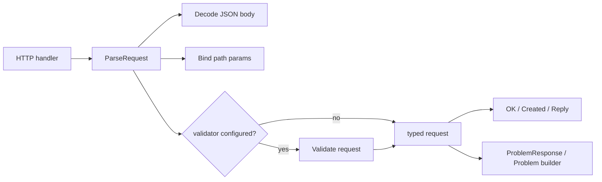
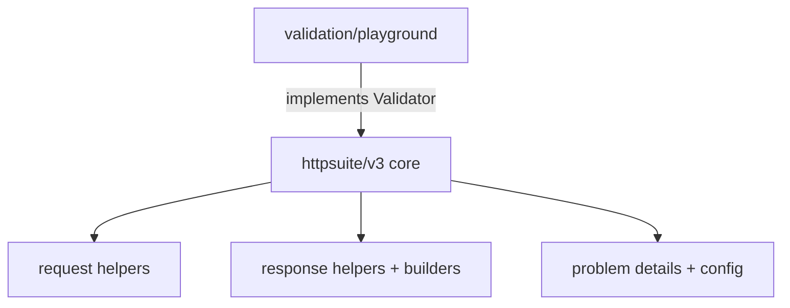

# httpsuite

`httpsuite` is a Go library for request parsing, response writing, and RFC 9457 problem responses.

`v3` keeps the root module stdlib-only and moves validation to an optional submodule.

## Features

- Parse JSON request bodies with a default `1 MiB` limit
- Return `413 Payload Too Large` when the configured body limit is exceeded
- Bind path params explicitly through a router-specific extractor
- Validate automatically during `ParseRequest` when a global validator is configured
- Keep `ParseRequest` panic-safe for invalid inputs and return regular errors instead
- Return consistent [RFC 9457 Problem Details](https://datatracker.ietf.org/doc/html/rfc9457)
- Write success responses with optional generic metadata
- Support both direct helpers and optional builders

## Supported routers

- [Chi](https://github.com/go-chi/chi)
- [Gorilla Mux](https://github.com/gorilla/mux)
- Go standard `http.ServeMux`

## Installation

Core:

```bash
go get github.com/rluders/httpsuite/v3
```

Optional validation adapter:

```bash
go get github.com/rluders/httpsuite/validation/playground
```

## Mental model

- request in: `ParseRequest(...)`
- success out: `OK(...)`, `Created(...)`, `Reply().Meta(...).OK(...)`
- problem out: `ProblemResponse(...)`, `NewBadRequestProblem(...)`, `Problem(...).Build()`
- validation: configure once with `SetValidator(...)`, override locally with `ParseOptions.Validator`

For simple handlers, prefer direct helpers.

When a handler needs custom headers, meta, or problem composition, use the optional builders.

`ParseRequest` never panics on invalid inputs such as a nil request, nil body, or nil path extractor. These cases return regular Go errors so callers can fail safely.

## Quick start

### Core only

```go
package main

import (
	"net/http"
	"strconv"

	"github.com/go-chi/chi/v5"
	"github.com/rluders/httpsuite/v3"
)

type CreateUserRequest struct {
	ID   int    `json:"id"`
	Name string `json:"name"`
}

func (r *CreateUserRequest) SetParam(fieldName, value string) error {
	if fieldName != "id" {
		return nil
	}

	id, err := strconv.Atoi(value)
	if err != nil {
		return err
	}
	r.ID = id
	return nil
}

func main() {
	router := chi.NewRouter()

	router.Post("/users/{id}", func(w http.ResponseWriter, r *http.Request) {
		req, err := httpsuite.ParseRequest[*CreateUserRequest](w, r, chi.URLParam, nil, "id")
		if err != nil {
			return
		}

		httpsuite.OK(w, req)
	})

	_ = http.ListenAndServe(":8080", router)
}
```

Try it:

```bash
curl -X POST http://localhost:8080/users/123 \
  -H "Content-Type: application/json" \
  -d '{"name":"Ada"}'
```

### Core + validation

```go
validator := playground.NewWithValidator(nil, &httpsuite.ProblemConfig{
	BaseURL: "https://api.example.com",
})

httpsuite.SetValidator(validator)

// Validation uses the problem status returned by the configured validator.
// If the validator returns 422, ParseRequest writes 422.

req, err := httpsuite.ParseRequest[*CreateUserRequest](
	w,
	r,
	chi.URLParam,
	&httpsuite.ParseOptions{
		MaxBodyBytes: 1 << 20,
	},
	"id",
)
```

### Direct helpers

```go
httpsuite.OK(w, user)
httpsuite.OKWithMeta(w, users, httpsuite.NewPageMeta(page, pageSize, totalItems))
httpsuite.Created(w, user, "/users/42")
httpsuite.ProblemResponse(w, httpsuite.NewNotFoundProblem("user not found"))
```

### Fluent helpers

```go
httpsuite.Reply().
	Meta(httpsuite.NewPageMeta(page, pageSize, totalItems)).
	OK(w, users)

httpsuite.Reply().
	Header("X-Request-ID", requestID).
	Created(w, user, "/users/42")
```

### Builders

```go
problem := httpsuite.Problem(http.StatusNotFound).
	Type(httpsuite.GetProblemTypeURL("not_found_error")).
	Title("User Not Found").
	Detail("user 42 does not exist").
	Instance("/users/42").
	Build()

httpsuite.RespondProblem(problem).
	Header("X-Trace-ID", traceID).
	Write(w)
```

## Architecture

- root module: `github.com/rluders/httpsuite/v3`
- optional validation adapter: `github.com/rluders/httpsuite/validation/playground`
- root stays stdlib-only
- validation is opt-in at bootstrap, automatic at parse time when configured
- response metadata is generic and can use `PageMeta` or `CursorMeta`





## Migration from v2 to v3

- update imports from `github.com/rluders/httpsuite/v2` to `github.com/rluders/httpsuite/v3`
- update `ParseRequest` calls to pass `opts` before `pathParams`
- configure validation globally with `httpsuite.SetValidator(...)` or `playground.RegisterDefault()`
- `ParseRequest` now validates automatically when a validator is configured
- validator-provided `ProblemDetails.Status` is respected when valid
- use `ParseOptions.SkipValidation` to opt out per call
- use `ParseOptions.Validator` to override the global validator per call
- use `ProblemConfig` when you want custom problem type URLs

## Examples

Examples live in [`examples/`](examples/).

- [`examples/stdmux`](examples/stdmux/main.go): core-only with `http.ServeMux`
- [`examples/gorillamux`](examples/gorillamux/main.go): path params with Gorilla Mux
- [`examples/chi`](examples/chi/main.go): global validation with Chi
- [`examples/restapi`](examples/restapi/main.go): fuller REST API example with pagination-style metadata and custom problems

`examples/restapi` shows:

- global validator setup with `playground`
- `ProblemConfig` with custom type URLs
- create, get, and list endpoints
- `PageMeta` and `CursorMeta`
- direct helpers and fluent helpers together
- custom `ProblemDetails` for domain-level `404`s

## Notes for contributors

- request facade and helpers live in `request*.go`
- response facade, helpers, builders, and write internals live in `response*.go`
- problem details, config, builders, and helpers live in `problem*.go`

## Release workflow

The release workflow supports two paths:

- push an existing `v*` tag to verify and publish that release
- run `Release` with `workflow_dispatch` and choose `major`, `minor`, or `patch`

On manual dispatch, the workflow finds the latest `v*` tag, bumps it according to the selected semantic version part, pushes the new tag, and publishes the GitHub release for that tag.

## Tutorial

- [Improving Request Validation and Response Handling in Go Microservices](https://medium.com/@rluders/improving-request-validation-and-response-handling-in-go-microservices-cc54208123f2)

> Do you have a project example or a tutorial? Add it here.

## Contributing

Contributions are welcome:

- open an issue
- submit a PR
- add a router example

## License

MIT. See [LICENSE](LICENSE).
